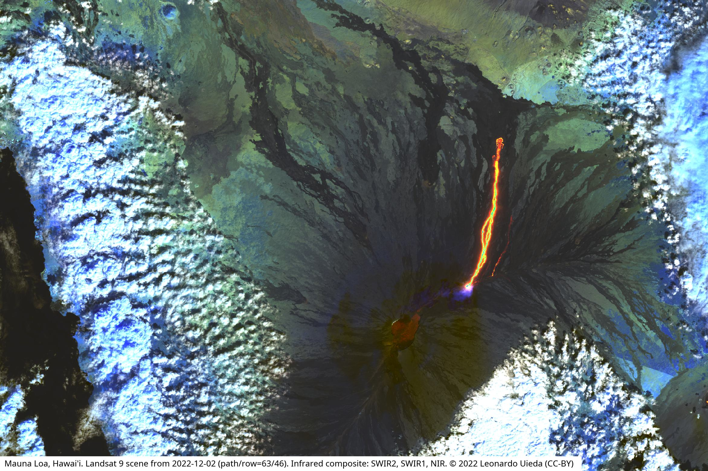

# Plot Landsat 9 scenes of the Mauna Loa eruption

Download some selected Landsat 9 scenes that show the eruption and make plots
to show what's going on. 
Uses [xlandsat](https://www.compgeolab.org/xlandsat) to load the scenes and
make composites.

The scenes were downloaded from [USGS Earth Explorer](https://earthexplorer.usgs.gov/)
and archived on figshare: https://doi.org/10.6084/m9.figshare.21677246

> For more information on the eruption, please refer to the 
> [Hawaiian Volcano Observatory](https://www.usgs.gov/observatories/hvo) website.

<figure>

<figcaption>
Satellite image (Landsat 9) taken on 2022/12/02 of the Mauna Loa volcano, surrounded by clouds and with the current lava flows showing up as a bright red and green North-South line in the middle of the image. The image is an infrared composite where the red colors represent the SWIR2 band, green is SWIR1, and blue is NIR.
</figcaption>
</figure>

## License

All Python source code is made available under the 
[MIT license](https://github.com/compgeolab/mauna-loa-landsat-2022/blob/main/LICENSE). 
You can freely use and modify the code, without warranty, so long as you provide 
attribution to the authors.

Unless otherwise specified, all figures and Jupyter notebooks are available under the 
[Creative Commons Public Domain Dedication (CC0)](https://creativecommons.org/publicdomain/zero/1.0/).
